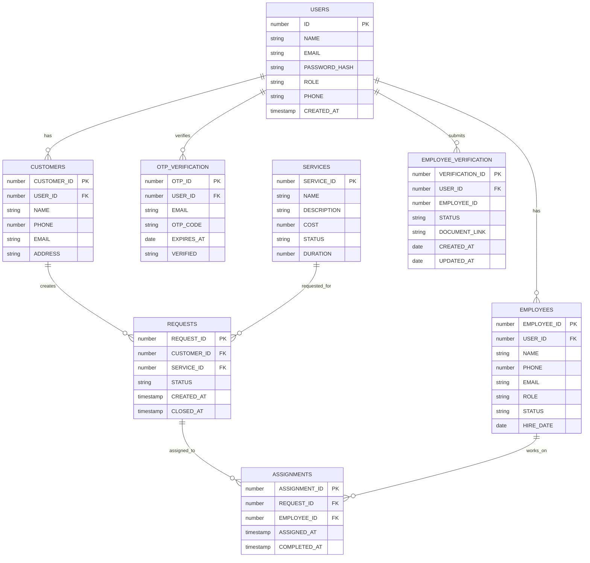

# TaskOps – Service Management System

## Project Overview
TaskOps is a full-stack Service Management System built with Next.js (frontend), Node.js/Express (backend), and Oracle Database. It provides a role-based experience for Customers, Employees, and Admins. New users register via a two-step signup gated by OTP email verification (Mailjet). Employees must submit verification for Admin approval before gaining access. Admins can approve/reject employee verification and applicants are notified by email.

## Tech Stack
- Frontend: Next.js (App Router), React, Tailwind CSS
- Backend: Node.js, Express.js
- Database: OracleDB (oracledb driver)
- Email: Mailjet (node-mailjet)
- Environment: .env files for frontend and backend

## Features
- OTP-based email verification (Mailjet) during signup with a two-step UI (Send OTP → Verify → Full form)
- Single email field that becomes disabled after OTP is verified
- Role-based accounts: Customer, Employee, Admin
- Employee verification workflow (submit document link + role → Admin approval/rejection)
- Admin actions trigger Mailjet emails to applicants on approval or rejection
- Duplicate email protection:
  - OTP is not sent to already-registered emails
  - User creation returns a clear conflict error if email already exists
- Employee signup uses a styled role dropdown
- Modern, responsive UI using Tailwind CSS

## Environment Variables

Backend (.env)
- PORT=5000
- DB_USER=...
- DB_PASSWORD=...
- DB_CONNECT=host:port/service
- MJ_APIKEY_PUBLIC=your_mailjet_public_key
- MJ_APIKEY_PRIVATE=your_mailjet_private_key
- MJ_SENDER_EMAIL=verified_sender@example.com
- MJ_SENDER_NAME=TaskOps
- Optional (supported fallback): MJ_API_KEY, MJ_SECRET_KEY

Frontend (.env.local)
- NEXT_PUBLIC_BACKEND_URL=http://localhost:5000

Notes
- Emails are sent via Mailjet using the `mailSender` utility.
- Approval emails link to http://localhost:3000/employee/dashboard.

## Installation & Setup

1) Backend
- `cd backend`
- `npm install`
- Create `.env` with DB and Mailjet variables (see above)
- Ensure Oracle Instant Client is installed and accessible (required by `oracledb`)
- `npm start` (starts at PORT, default 5000)

2) Frontend
- `cd frontend`
- `npm install`
- Create `.env.local` with `NEXT_PUBLIC_BACKEND_URL`
- `npm run dev` (runs on http://localhost:3000)

3) Database (Oracle)
- Run the SQL scripts in this order:
  - `sms_db.sql` (core schema)
  - `employee_verification.sql` (verification schema)
  - `Otp_verification.sql` (OTP storage)
  - `triggers_and_sequences.sql` (if present/applicable)

## Mailjet Configuration
1. Create a Mailjet account.
2. Verify your sender email/domain (the sender must match `MJ_SENDER_EMAIL`).
3. Generate API keys and set `MJ_APIKEY_PUBLIC` and `MJ_APIKEY_PRIVATE` (or the supported fallback names).
4. Restart the backend after setting environment variables.
5. Check console logs for `Mailjet send response` or `Mailjet send error` on email operations.

## Database Schema / Required Tables
- USERS (ID, NAME, EMAIL, PASSWORD_HASH, ROLE, PHONE, CREATED_AT)
- CUSTOMERS (CUSTOMER_ID, USER_ID → USERS.ID, NAME, PHONE, EMAIL, ADDRESS)
- EMPLOYEES (EMPLOYEE_ID, USER_ID → USERS.ID, NAME, PHONE, EMAIL, ROLE, STATUS, HIRE_DATE)
- SERVICES, REQUESTS, ASSIGNMENTS (as required by the request workflow)
- EMPLOYEE_VERIFICATION (VERIFICATION_ID, USER_ID, EMPLOYEE_ID, STATUS, DOCUMENT_LINK, ...)
- OTP table (created by `Otp_verification.sql`) storing OTP codes with TTL

## Role Flows
- Customer
  - Signup (OTP verification) → Create USERS row → Create CUSTOMERS record.
- Employee
  - Signup (OTP verification) → Create USERS row → Submit verification (`document_link`, role)
  - Admin approval required to finalize access; emails sent on decision.
- Admin
  - Review pending employee verifications → Approve/Reject → Applicant notified by email.

## Notes on OTP + Employee Verification Logic
- OTP
  - `POST /api/otp/send` sends a 6-digit OTP via Mailjet only if the email is not already registered.
  - `POST /api/otp/verify` validates OTP; signup proceeds only after verification.
- User Creation
  - `POST /api/users` requires prior OTP verification.
  - If the email already exists, returns 409 with `{ "message": "User with this email already exists" }`.
- Employee Verification
  - `POST /api/employee-verification` creates a verification request.
  - Admin `PATCH /api/employee-verification/:id/approve|reject` updates status and sends Mailjet email to the applicant.

## Troubleshooting
- Mail delivery
  - Ensure `MJ_APIKEY_PUBLIC/MJ_APIKEY_PRIVATE` (or fallback names) and `MJ_SENDER_EMAIL` are set.
  - Verify the sender domain/email in Mailjet.
  - Check backend logs for `Mailjet send response` / `Mailjet send error`.
- OracleDB
  - Install Oracle Instant Client and ensure `DB_CONNECT` is correct.
  - Verify DB user privileges and that all SQL scripts have been executed.
- API base URLs
  - Ensure `NEXT_PUBLIC_BACKEND_URL` matches the backend URL and ports.
- OTP not arriving
  - Check Spam/Promotions folders.
  - Verify Mailjet sender/domain and quota.

---

A full‑stack service management platform built with Next.js (App Router), Express.js, Socket.IO, and Oracle Database. It supports multi‑role workflows (customer, employee, admin), request lifecycle management, employee assignment, real‑time chat per request, and employee verification.

## Highlights

- **Roles**: customer, employee, admin
- **Core entities**: Users, Customers, Employees, Services, Requests, Assignments, Employee Verification
- **Auth**: NextAuth Credentials -> hits backend `POST /api/auth/login`
- **DB**: Oracle with sequences + triggers for IDs
- **Realtime**: Socket.IO chat on request rooms with authorization guards

# Architecture

- **Frontend (Next.js 13+)**
  - Path-based role dashboards under `src/app/{role}/...`
  - NextAuth credentials provider at `src/app/api/auth/[...nextauth]/route.js`
  - `ChatModal.jsx` connects to backend via Socket.IO using `NEXT_PUBLIC_BACKEND_URL`
- **Backend (Express)**
  - Routers: customers, services, requests, employees, assignments, users, auth, employee-verification
  - Controllers + Models (Oracle SQL)
  - Socket.IO server mounted on the same HTTP server
- **Database (Oracle)**
  - Tables defined in `sms_db.sql` and `employee_verification.sql`
  - Sequences + triggers per table to generate IDs

# Project Structure (actual)

```
Service_Management/
├─ backend/
│  └─ src/
│     ├─ app.js                      # Express app + Socket.IO chat
│     ├─ config/db.js                # Oracle config + test connection
│     ├─ routes/                     # REST routes
│     ├─ controllers/                # Request handlers
│     └─ models/                     # SQL access
├─ frontend/
│  └─ src/app/
│     ├─ api/auth/[...nextauth]/route.js
│     ├─ components/{AuthProvider,ProtectedRoutes,ChatModal}.jsx
│     ├─ {about,page}.js, layout.js, globals.css
│     ├─ admin/{dashboard,services,employees,requests,customers,...}
│     ├─ customer/{dashboard,myRequests}
│     └─ employee/{dashboard,requests,assignments,layout.js}
├─ sms_db.sql                         # Core schema
├─ employee_verification.sql          # Verification schema
└─ README.generated.md
```

# Data Model and ER Diagram

Entities and relations inferred from SQL and queries:

- **USERS**(ID, NAME, EMAIL, PASSWORD_HASH, ROLE, PHONE, CREATED_AT)
- **CUSTOMERS**(CUSTOMER_ID, USER_ID → USERS.ID, NAME, PHONE, EMAIL, ADDRESS)
- **EMPLOYEES**(EMPLOYEE_ID, USER_ID → USERS.ID, NAME, PHONE, EMAIL, ROLE, STATUS, HIRE_DATE)
- **SERVICES**(SERVICE_ID, NAME, DESCRIPTION, COST, STATUS, DURATION)
- **REQUESTS**(REQUEST_ID, CUSTOMER_ID → CUSTOMERS.CUSTOMER_ID, SERVICE_ID → SERVICES.SERVICE_ID, STATUS, CREATED_AT, CLOSED_AT)
- **ASSIGNMENTS**(ASSIGNMENT_ID, REQUEST_ID → REQUESTS.REQUEST_ID, EMPLOYEE_ID → EMPLOYEES.EMPLOYEE_ID, ASSIGNED_AT, COMPLETED_AT)
- **EMPLOYEE_VERIFICATION**(VERIFICATION_ID, USER_ID → USERS.ID, EMPLOYEE_ID nullable, STATUS, DOCUMENT_LINK, CREATED_AT, UPDATED_AT)



# Request Lifecycle and Flows

- **Customer flow**
  - Customer (linked to a `USERS` row) submits a service request against a `SERVICE`.
  - `POST /api/requests` with `{ customerId, serviceId }` creates a `REQUESTS` row (status: Pending).
  - Customer can view their requests from frontend pages under `customer/`.

- **Admin flow**
  - Views all requests and unassigned items (`GET /api/requests`, `/api/assignments/requests/all`).
  - Assigns an employee to a request via `POST /api/assignments` with `{ requestId, userId }`.
  - Managing catalogs via Services and Users APIs.

- **Employee flow**
  - Employee (must be approved via Employee Verification) appears in `EMPLOYEES`.
  - Sees assignments with `GET /api/assignments/employee/:userId`.
  - Marks assignment complete via `PATCH /api/assignments` -> sets `ASSIGNMENTS.COMPLETED_AT`, and `REQUESTS` is set to `Completed` + `CLOSED_AT` timestamp.

- **Verification flow**
  - User submits verification: `POST /api/employee-verification` with `{ user_id, document_link, role? }`.
  - Admin lists pendings `GET /api/employee-verification/pending`, then approves `PATCH /:id/approve` or rejects `/:id/reject`.
  - `employeesController.addOneEmployee` enforces latest verification status be `Approved` before inserting into `EMPLOYEES`.

- **Status management**
  - Requests initially `Pending`.
  - On assignment, set to `In Progress`.
  - On completion, set to `Completed` (and `CLOSED_AT` set).
  - Housekeeping endpoint: `PUT /api/requests/incomplete` sets unassigned `In Progress` back to `Pending`.

# Realtime Chat (per Request)

- Socket.IO server in `backend/src/app.js` with in‑memory store per `requestId`.
- Join room: client emits `join` with `{ requestId, userId, userType, name }`.
  - Server validates participant: employees (via `ASSIGNMENTS`+`EMPLOYEES.USER_ID`), customers (via `REQUESTS`+`CUSTOMERS.USER_ID`).
  - If request is completed, emits `chatClosed`.
- Send message: client emits `message` with `{ requestId, text, userId, userType, name, ts }`.
  - Server validates and broadcasts to room; retains last 200 messages in memory.
- Frontend: `ChatModal.jsx` connects using `NEXT_PUBLIC_BACKEND_URL` and renders history/messages.

# REST API (actual routes)

Base URL: `http://localhost:5000/api`

- **Auth**
  - `POST /auth/login` → `usersController.loginUser`
- **Users**
  - `GET /users` | `GET /users/:id` | `POST /users` | `DELETE /users/:id`
- **Customers**
  - `GET /customers`
  - `POST /customers`
  - `DELETE /customers/:customer_id`
  - `GET /customers/:user_id` (fetch by linked user)
- **Services**
  - `GET /services` | `GET /services/:id`
  - `POST /services` | `PUT /services/:id` | `DELETE /services/:id`
- **Requests**
  - `GET /requests` (with details)
  - `GET /requests/all` (raw list)
  - `POST /requests` (create)
  - `PUT /requests` (update status)
  - `PUT /requests/incomplete` (housekeeping)
  - `DELETE /requests/:requestId`
- **Assignments**
  - `GET /assignments`
  - `GET /assignments/requests/all` (assigned + unassigned)
  - `GET /assignments/employee/:userId`
  - `POST /assignments` (assign by userId → resolves to EMPLOYEE_ID)
  - `PATCH /assignments` (mark completed)
  - `DELETE /assignments/:assignmentId`
- **Employee Verification**
  - `POST /employee-verification`
  - `GET /employee-verification/pending`
  - `PATCH /employee-verification/:id/approve`
  - `PATCH /employee-verification/:id/reject`
  - `GET /employee-verification/approved`

# Environment Variables

- Backend `.env`
  - `PORT=5000`
  - `DB_USER=...`
  - `DB_PASSWORD=...`
  - `DB_CONNECT=host:port/service` (used as `connectString`)
- Frontend `.env.local`
  - `NEXT_PUBLIC_BACKEND_URL=http://localhost:5000`
  - `NEXTAUTH_SECRET=...`
  - `NEXTAUTH_URL=http://localhost:3000`

# Setup

1) Backend
- `cd backend && npm install`
- Create `.env` with DB creds above
- `npm start` (server on 5000)
- On start, `initDB()` validates Oracle connectivity

2) Frontend
- `cd frontend && npm install`
- Create `.env.local` with vars above
- `npm run dev` (web on 3000)

3) Database
- Run `sms_db.sql` then `employee_verification.sql`
- This creates tables, sequences, and triggers for auto IDs

# Notes and Constraints

- Passwords stored as `PASSWORD_HASH` (bcrypt in `usersController`)
- Employee insertion is blocked until verification status is `Approved`
- Chat history is in‑memory per process; not persisted
- Oracle queries are parameterized and use `autoCommit` for write ops

# License
@pranavsresh1947@gmail.com